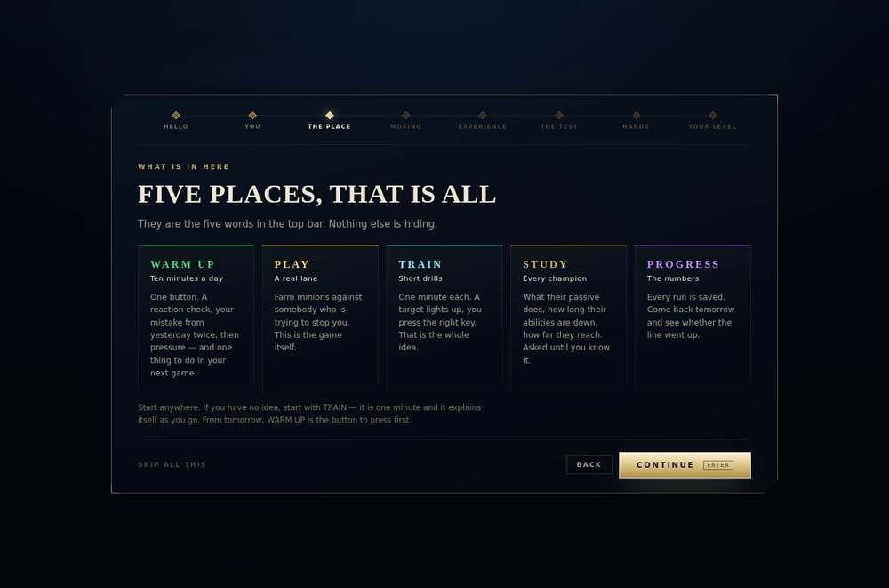
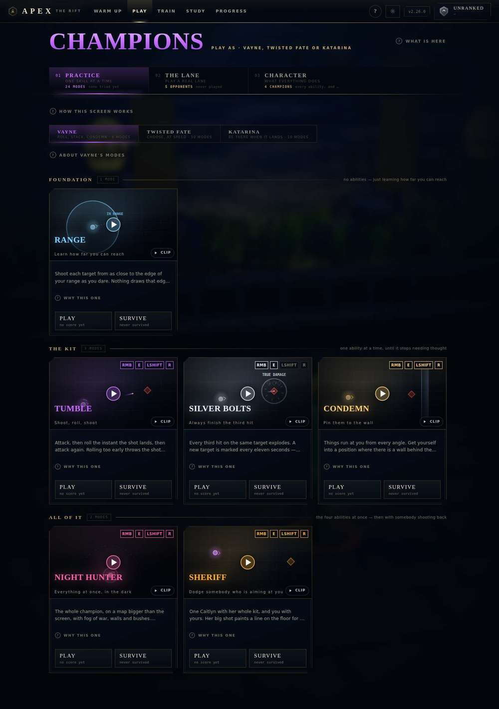
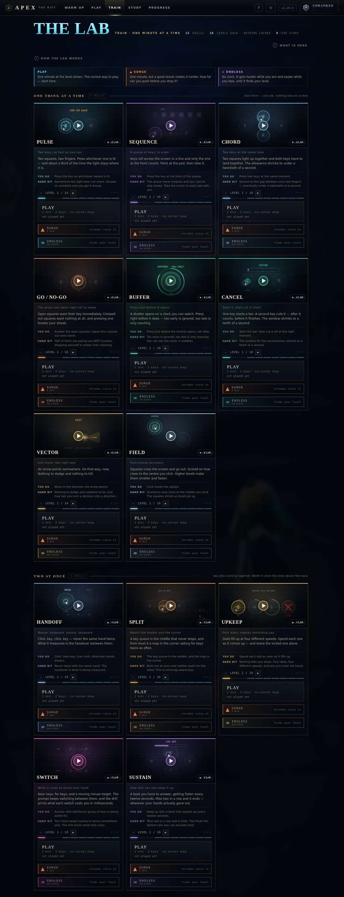
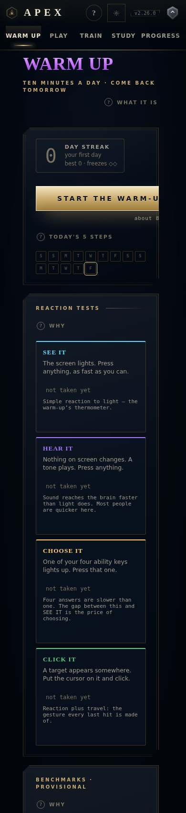
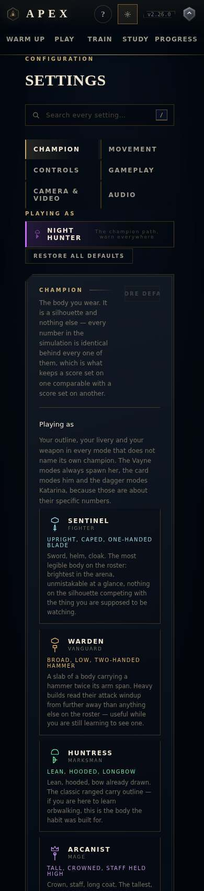
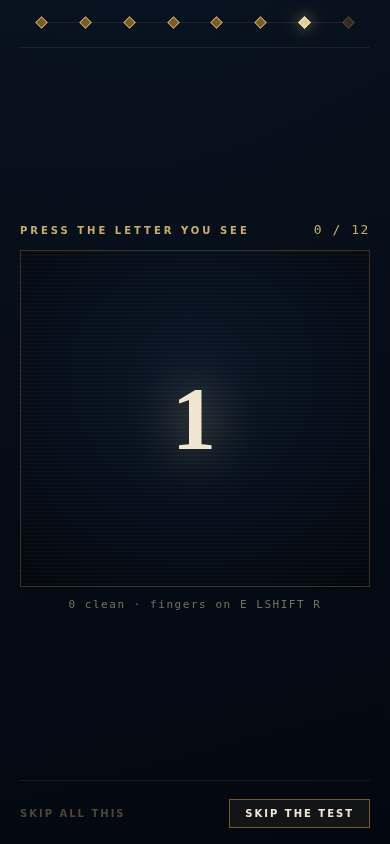

# The APEX overhaul — Phase 1 audit and proposal

*Audit of v2.26.0 (commit `0d32bb3`). No application code has changed yet. This
document proposes the plan, and Phase 2 waits for a go-ahead.*

**The one question:** does a player reach the thing that makes them better
sooner, and with less to read?

Today the answer is "not quite". The client is deep, correct and well made,
but a new player meets 589 words and 8 steps before their first run. The five
tabs split one job, choosing a run, across four places. The prose explains the
client in its own vocabulary (rungs, benches, the ladder, transfer), and at
390px panels are cut off on the right.

---

## 1. At a glance

| | Today (measured) | Target |
| --- | --- | --- |
| Walkthrough | **8 steps, 589 words**, ends on TRAIN, not in a run | **≤ 3 steps**, every one skippable, the first run starts from step 1 |
| Title card → real run | Fastest: **3 clicks + 1 scroll** (key, "SKIP ALL THIS", a PLAY below the fold). Guided: **10 clicks** | **2 clicks** (key, then "Click to move" or "WASD", which starts the run) |
| Nav destinations | 5 tabs, plus 5 corner controls that are also destinations or duplicates (logo → PLAY, rank chip → PROGRESS, ?, SETUP, version → patch notes) | **4 tabs + settings = 5**, no duplicates, nothing hidden |
| Words, main screens (desktop) | WARM UP 347 · PLAY 477 · TRAIN 1,219 · STUDY 162 · PROGRESS 356 · Settings 508 | Each **≤ half** (see §7.4) |
| Primary action per screen | WARM UP 1 · PLAY 0 · TRAIN 0 · STUDY 0 · PROGRESS 0 | **Exactly 1 on every screen** |
| Type sizes / paddings / colours in CSS | **57** font sizes · **122** padding values · **91** hex colours · ~25 breakpoints | 6 sizes · the 8-step spacing scale · tokens only · 3 breakpoints |
| Tap targets under 44px at 390px | 11–76 per screen | 0 |
| Text below WCAG AA | `--text-3` (3.8–4.1:1) on 106 rules, `--text-4` (≈2:1) on 42 | All text ≥ 4.5:1 |
| Tab switch → next paint (arena off) | PLAY 70 ms · TRAIN 150 · WARM UP 182 · PROGRESS 216 · STUDY 262 | ≤ 100 ms each |

Key screenshots (all under `docs/overhaul/before/`):

| First run: 8 steps of this | PLAY: 49 controls, no primary button | TRAIN: 1,219 words, 103 controls |
| --- | --- | --- |
|  |  |  |

| 390px: CTA cut off | 390px: settings cut off | 390px: the hand test needs a keyboard |
| --- | --- | --- |
|  |  |  |

---

## 2. Method

- **Harness.** A Playwright script, modelled on `tools/record.mjs`, builds a
  throwaway copy of the client with `PLAY_SECONDS = 6`, serves it, and walks
  every screen and state at **1360×900** and at **390×844** (touch, mobile UA).
  It captures a fresh profile (title card, all 8 walkthrough steps, first run),
  an onboarded empty profile (every tab and sub-tab, settings, patch notes, an
  open "?"), and a played profile (HUD, pause, results folded and opened,
  rank-up, then every tab again). I will commit it in Phase 2 as
  `tools/shots.mjs` so the proof uses the same instrument.
- **Words** means visible words on the page, including the parts you scroll
  to, excluding the top bar, closed "?" panels, `aria-hidden` text and tooltips.
- **Timings** come from the cloud container. It has no GPU, so WebGL runs on
  SwiftShader at about one frame a second, and the title → run seconds here are
  inflated (12 s at 390px, 30 s at 1360px, mostly arena build and countdown).
  Before and after will be compared in the same environment. The interface's
  own cost is measured with the arena off (Reduced effects), as
  `docs/v2.24-proof.md` did.
- **Accessibility**: axe-core 4 on each tab at both sizes, a Tab walk of PLAY,
  and contrast computed from the tokens. axe cannot rate text on the
  translucent panels over the WebGL canvas, so it reports those as
  "incomplete" rather than as violations.
- **Baseline**: `npm run typecheck` ✓, `npm test` ✓ (ALL CHECKS PASSED).

---

## 3. Screen inventory

Word counts are for desktop; 390px counts are within 5%. The "Controls" column
counts buttons, tabs, inputs and clickable elements that are visible or reached
by scrolling. Screenshot references use the file names in `docs/overhaul/before/`.

| Screen | Purpose | Primary action today | Words | Controls | Components |
| --- | --- | --- | --- | --- | --- |
| Title card | Hide the arena build; unlock audio | Press any key | 12 | 0 | Boot, Crest, load bar |
| Walkthrough (8 steps) | Name, tour, movement scheme, experience, hand test, level | CONTINUE ×7 | 589 total | 4–9 per step | Welcome (own CSS, 599 lines) |
| **WARM UP** (returning landing) | Daily routine, streak | START THE WARM-UP ✓ | 347 | 31 | page header, streak, week strip, 4 reaction cards, benchmark table (9 rows), code box, legal notice |
| **PLAY › PRACTICE** (new-player landing) | Champion modes | *none*: 24 cards × PLAY/SURVIVE, all equal | 477 | 49 | page header, 3-tab rail, champion switch, group heads, mode cards (clip, keys, brief, "?", 2 buttons) |
| PLAY › THE LANE | Full lane vs a bot | *none*: 3 length buttons equal | 214 | 26 | lane card, tier picker, length buttons |
| PLAY › CHARACTER (the codex) | Kit numbers and sources | n/a (reference) | 596 | 20 | 5-way switch, ability table |
| **TRAIN** ("THE LAB") | 13 hand drills × 10 levels | *none*: 13 × (PLAY, SURGE, ENDLESS, level stepper, clip) | 1,219 | 103 | tally, 3-mode legend, bind warning, key ladder, drill cards |
| **STUDY › QUIZ** | Champion knowledge quiz | *none*: PLAY / SURVIVE / REVIEW as three equal cards | 162 | 29 | 2-tab switch, 3 start cards, topic chips, scope chips |
| STUDY › CHAMPIONS | 173-champion reference | Search | 511 | 187 | search, name grid, champion card |
| **PROGRESS** | Rank, skills, mistakes, history | *none* ("TRAIN 1 V 1" in one empty state) | 356 empty / 358 played | 13–15 | profile head, 30-day card, radar, skill bars, retention, readiness ladder, mistakes, history, runs, 5 stat tiles, reset |
| Settings | Controls, audio, video, look | n/a (opens on **CHAMPION**, the silhouette picker) | 508 | 31 | own header, search, side nav, "Playing as" card, 10 roster cards |
| Patch notes | Changelog | n/a | 1,915 | 52 | own header, entries |
| In run: HUD | Play | n/a | ~40 | n/a | GameView |
| Results (folded) | Score, verdict, next step | RUN AGAIN ✓ | 64 | 4 | score, limiter, 3 buttons, "Why — the evidence" |
| Results (evidence) | Everything else | RUN AGAIN ✓ | ~250 | 11 | stats, rating, "the read", replay, rhythm, code |
| Rank-up | Ceremony | CONTINUE ✓ | 12 | 1 | RankUp |

### 3.1 Issues, screen by screen

**Title card** (`d-title.jpg`)
- T1. Fine as it is: it hides real work and unlocks audio. Keep it.

**Walkthrough** (`d-welcome-1.jpg`, `d-welcome-3-tour.jpg`, `d-welcome-8-verdict.jpg`, `m-welcome-test.jpg`)
- W1. 8 steps and 589 words before any play. The rail of eight labelled pips
  announces the length up front.
- W2. It ends on TRAIN, not in a run, which costs one more decision on a
  103-control screen.
- W3. "SKIP ALL THIS" is the only fast path, and it is the dimmest text on the
  card (`--text-4`-grade contrast).
- W4. The hand test needs a physical keyboard ("fingers on E LSHIFT R"). On a
  phone it cannot be passed, only skipped.
- W5. Step 3 teaches the five tabs with 5 × 25-word cards. That means the nav
  cannot explain itself, which is the thing to fix rather than teach.
- W6. The "How much League have you played?" step only nudges the level by ±1.

**WARM UP** (`d-warmup.jpg`, `m-warmup.jpg`)
- U1. Good: one primary above the fold. Everything under it competes: 4
  reaction cards, a 9-row benchmark table (each row: tier, bar, code, PLAY),
  a code box and a legal paragraph. Most of the 347 words are below the button.
- U2. Benchmarks and reaction tests are measurements. Their natural home is
  PROGRESS, which today has no way to take one.
- U3. The scenario-code box is a way to *start a run*. It belongs with PLAY.
- U4. At 390px the CTA is cut off ("START THE WARM-U", "about 8") and the
  14-day strip wraps into two uneven rows.
- U5. The benchmark table prints raw codes (`vayneTumble-P50-fl4ma-J`) in
  every row.

**PLAY** (`d-play-practice.jpg`, `d-play-lane.jpg`, `d-play-codex.jpg`, `m-play-practice.jpg`, `m-play-lane.jpg`)
- P1. The name changes three times: nav says PLAY, the heading says
  CHAMPIONS, the first sub-tab says PRACTICE. The third sub-tab is
  "CHARACTER" on screen but "THE CODEX" in the code, the README and the brief.
- P2. The "How this screen works" text is 104 words, and it still refers to
  "three tabs" and "CHARACTER".
- P3. No primary action: 24 cards with two equal buttons each. The whole card
  is also a PLAY target, and hovering it plays a clip. There are three ways to
  start and none is signposted.
- P4. Four levels of "?": page, section, champion, card. A card's brief is cut
  at two lines with "…", so the text is shown and hidden at once.
- P5. TRAIN is the same activity (pick a card, play a minute) in a separate
  tab with a separate name ("THE LAB").
- P6. At 390px the lane card's record is clipped ("NO LANE AGAI"), and
  "CHALLENGER" overflows its tier button.

**TRAIN / THE LAB** (`d-train.jpg`, `m-train.jpg`)
- L1. The longest screen: 1,219 words and 103 controls. Each of the 13 cards
  carries a brief, "you do", "hard bit", a level stepper, three mode buttons
  (PLAY, SURGE, ENDLESS) and a clip.
- L2. The header shows three tallies ("13 DRILLS · 10 LEVELS EACH · NOTHING
  LOCKED · 0/390 STARS") and a three-card mode legend before the first drill.
- L3. At 390px the "CLIP" chip overlaps the drill name, and 76 controls are
  under 44px.

**STUDY** (`d-study-quiz.jpg`, `d-study-champions.jpg`)
- S1. The best screen: short and clear. But PLAY, SURVIVE and REVIEW are three
  equal cards, and nothing says which to press. Topic and scope chips are 27px
  tall.
- S2. The 173-name grid is fine; keep it.

**PROGRESS** (`d-progress-empty.jpg`, `d-progress-populated.jpg`)
- R1. Empty, it is seven panels of "not enough data" / "unrated" (356 words)
  with no action except one "TRAIN 1 V 1". A single empty state with one
  button says the same thing.
- R2. Populated, there is still no primary action. The "fix this" route
  (`onPlay(practiceFor(id))`) exists but is buried in the mistakes accordion.
- R3. Jargon: "How well it holds up" (retention), "Ready for a real game?"
  with FOUNDATION / ISOLATED / COMBINED / PRESSURE / TRANSFER, "mastery", and
  radar plus bars showing the same ten skills twice.
- R4. RESET PROFILE sits on the stats page, one click from a rename.

**Settings** (`d-settings.jpg`, `m-settings.jpg`)
- G1. Opens on CHAMPION (cosmetic, 10 roster cards and about 300 words of
  flavour) rather than on Controls, the reason people come here.
- G2. "Playing as" appears twice (in the side nav and in the section).
- G3. At 390px "RESTORE DEFAULTS" is clipped ("ORE DEFA"), and the section
  text wraps to a 16-character column.
- G4. The top-bar button says SETUP; the page says SETTINGS and
  "Configuration".

**Patch notes** (`d-patch.jpg`)
- N1. Reached only through the version chip (61×13px at 390px). That is a
  hidden destination.

**Results and rank-up** (`d-results.jpg`, `d-results-evidence.jpg`, `d-rankup.jpg`)
- X1. Good bones from v2.24: one number, one verdict, one primary. Keep.
- X2. "BEST 0 · LEVEL WITH YOUR LAST RUN" reads as "level" (a drill level),
  not "equal".
- X3. With the evidence open, "the read" repeats the verdict sentence word
  for word.
- X4. Rank-up is the right amount of delight. It stays the one ceremony.

**In a run** (`d-hud.jpg`)
- H1. Banners like "MARK · CALIBRATE · CHECKS ARE FREE" are jargon, but they
  are written by the drills and budgeted by `simtest`. They are out of scope
  here (see §10).

### 3.2 Cross-cutting issues

**Navigation**
- N-a. Choosing a run happens in four places: PLAY, TRAIN, WARM UP
  (benchmarks, code box) and PROGRESS ("fix this").
- N-b. Duplicates and hidden routes: the logo goes to PLAY, the rank chip to
  PROGRESS, the version chip to patch notes, "?" to the tour, the gear to
  settings. The logo and rank chip are `<div onClick>` and cannot be reached
  by keyboard.
- N-c. The new-player landing is PLAY › PRACTICE; the returning landing is
  WARM UP. The walkthrough then sends new players to TRAIN, a third place.

**Copy**
- C-a. Internal vocabulary in UI strings: *bench* 48, *floor* 38, *rung(s)*
  46, *surge* 29, *roster* 16, *mastery* 15, *codex* 13, *the ladder* 12,
  *retention* 11, *transfer* 8.
- C-b. There are 18 `Why`/`Explainer` call sites in the five tabs. PLAY ›
  PRACTICE alone renders 9 "?" toggles (page, section, champion, and one per
  card), nested four deep. The "?" has become a second copy of the page.

**Visual system**
- V-a. `global.css` already has the right idea (`--sp-1…8`, `--t-*`, motion
  tokens), but the spacing tokens are used 10 times across 11,440 lines of
  CSS. There are 57 distinct font sizes (35 rules at 9px, 46 at 10px), 122
  padding values, 91 hex colours and 17 different cut-corner `clip-path`
  polygons.
- V-b. There are 27 page- or section-header classes (`pr-head`, `set-top`,
  `patch-head`, `prof-head`, `wu-today-head`…) and ~25 button-like classes
  (`btn`, `pr-go`, `wu-b-go`, `pr-seg-btn`, `st-scope-btn`, `*-chip`…).
- V-c. Every tab title is 72px foil display type, which pushes content down
  and makes each tab feel like a different app.

**Mobile (390×844)**
- M-a. Right-edge clipping inside panels on WARM UP, THE LANE, Settings and
  TRAIN. It never shows as horizontal scroll, because `body { overflow:
  hidden }` hides it.
- M-b. Undersized tap targets on every screen: nav tabs 42px tall, "?" 34px,
  gear 38px, version chip 61×13, rank chip 32×32, every "?" toggle 27px,
  study chips 27px, CLIP 26px.
- M-c. The walkthrough's hand test is keyboard-only.
- M-d. *Not a bug, but noted.* In both full mobile passes, the first run after
  the screenshots ended on "APEX FAILED TO LOAD". Starting runs at 390×844 in
  isolation, by tapping the card, clicking it, or pressing PLAY, with and
  without touch, reached the run and results every time (`m-results.jpg`).
  The trigger is the harness itself: for full-page captures it stretches the
  viewport to 390×9000, far past a WebGL surface limit. The Phase 2 harness
  captures long pages in viewport-sized slices instead.

**Accessibility**
- A-a. Contrast: `--text-3 #75705f` is 4.10:1 on `--bg` and 3.79:1 on panels,
  used for text in 106 rules, mostly at 9–11px. `--text-4 #4a4638` is about
  2:1, in 42 rules. `--gold-deep` is about 3:1, in 11. The rest pass
  comfortably: `--text` 15–16:1, `--text-2` 6.8–7.3:1, gold 8.4–9.1:1.
- A-b. Landmarks: every screen's `<header class="pr-head">` becomes a second
  `banner`, there is no `<main>`, and 5–98 nodes per screen sit outside any
  landmark (axe: `landmark-no-duplicate-banner`, `landmark-unique`, `region`).
- A-c. Headings: one `h1` per screen; section titles are `div.panel-title`,
  so there is no outline to navigate by.
- A-d. Nav: no `aria-current`. The logo and rank chip are not focusable.
- A-e. Focus is good: 25 of 25 Tab stops on PLAY show a visible ring. Keep it.
  But it takes 14 Tab presses from the nav to reach the first control that
  starts a run, past 4 "?" toggles and 3 champion buttons.
- A-f. Reduced motion: calm mode covers CSS and previews, but the
  `ArenaBackdrop` (camera drift, particles, animated champions) keeps moving
  under `prefers-reduced-motion`. Only the in-app Reduced effects switch
  stops it.

**Feel and performance**
- F-a. With the arena off, menus idle at 16.7 ms/frame (median and p95). Tab
  switches take 150–262 ms to the next paint, except PLAY at 70 ms. STUDY and
  PROGRESS build everything on mount. That is felt as a hitch.
- F-b. With the arena on, SwiftShader gives 1.8 s/frame here, so the arena's
  budget can only be compared relative to itself. Nothing in this plan adds
  work to the arena.

---

## 4. Proposed information architecture

### 4.1 The new nav: four tabs and a gear

```
┌──────────────────────────────────────────────────────────────────────────┐
│ ◈ APEX     HOME    PLAY    STUDY    PROGRESS ◈1260                    ⚙  │
└──────────────────────────────────────────────────────────────────────────┘
  at 390px:  ◈  HOME  PLAY  STUDY  PROGRESS  ⚙     (each ≥ 44×44)
```

| Destination | Why it survives | What it absorbs |
| --- | --- | --- |
| **HOME** | The reason to open the client every day: the streak and today's warm-up. It is also a new player's first action. It is today's WARM UP, renamed because it is where you land. | WARM UP's routine, streak and week. "Jump back in" (your last run, one button). |
| **PLAY** | Every run you can start, in one place. Choosing a run is one job, and today it is split over four screens. | PLAY (lane, three champions) and TRAIN (13 drills, as the **Drills** segment). The scenario-code box ("Have a code?"). |
| **STUDY** | Knowledge, not hands. It is a different activity with its own modes, and 173 champions would swamp PLAY. | Unchanged in shape. |
| **PROGRESS** | Your numbers, and the tests that produce them. Measurement belongs next to its results. | Benchmarks and reaction tests (from WARM UP). The rank chip becomes the badge on this tab, not a second link. |
| **⚙ Settings** (5th) | Setup, plus everything about the client. Esc still opens it. | Patch notes (unread dot moves to the gear), "Replay intro", sources and accuracy, the legal notice, reset profile, version. |

Removed as destinations: the logo (becomes decoration), the rank chip (folded
into the PROGRESS tab), "?" (tour replay moves to Settings › About) and the
version chip (moves to About). The count goes from 10 clickable things in the
top bar to 5.

**Why merge TRAIN into PLAY, and not something else.** The code records why the
lab left the champion screen: inside PLAY it "read as one more thing about
Vayne". The fix here is structural. **Drills** is the *first* segment of PLAY,
a peer of Lane, Vayne, Twisted Fate and Katarina, and not nested under any
champion. The alternative, keeping TRAIN and folding STUDY away, would bury the
newest feature, and it would still need a sixth destination for settings.

### 4.2 What moves where (every capability stays reachable)

| Capability | Today | Proposed |
| --- | --- | --- |
| Daily warm-up, streak, freezes, week strip | WARM UP | HOME (primary) |
| Warm-up summary card | WARM UP | HOME |
| Reaction tests (×4) | WARM UP | PROGRESS › Tests |
| Benchmarks (9) and their codes | WARM UP | PROGRESS › Tests (code shown in each row's "?") |
| Scenario code entry | WARM UP | PLAY header: "Have a code?" opens an inline field |
| Lane (5 opponents × 3 lengths) | PLAY › THE LANE | PLAY › **Lane** |
| 24 champion modes × PLAY/SURVIVE | PLAY › PRACTICE | PLAY › **Vayne / Twisted Fate / Katarina**; a mode switch at the top of the list (Play · Survive) replaces two buttons per card |
| 13 drills × 10 levels, SURGE, ENDLESS | TRAIN | PLAY › **Drills**; mode switch (Play · Surge · Endless) at the top; the level stepper stays on each card |
| Key ladder ("what each level adds") | TRAIN | PLAY › Drills "?" |
| Bind warning | TRAIN | PLAY › Drills (same logic, a two-line banner) |
| The codex: Vayne, TF, Katarina, Caitlyn kits | PLAY › CHARACTER | Behind each champion segment's "?" ("Vayne's numbers"); Caitlyn's behind the Sheriff card's "?" |
| Accuracy and sources (patch 26.18) | PLAY › CHARACTER › ACCURACY | Settings › About › Sources |
| Mode clips | every card | unchanged (hover or focus; the CLIP chip on touch) |
| Rewind, replay, ghost, evidence | results / in run | unchanged |
| STUDY quiz, review, champions | STUDY | unchanged; one primary |
| Rank, skills, mistakes, history, runs | PROGRESS | PROGRESS (one empty state until placed) |
| "Fix this" from a mistake | PROGRESS accordion | PROGRESS primary: "Train {weakest skill}" |
| Rename | PROGRESS (click name) | unchanged |
| Reset profile | PROGRESS footer | Settings › About (with the same confirm) |
| Settings sections | Settings (opens on Champion) | Settings, opens on **Controls**; Champion renamed **Look** and moved last |
| Patch notes | version chip | Settings › About › What's new (unread dot on the gear) |
| Walkthrough replay | "?" in top bar | Settings › About › Replay intro |
| Legal notice | WARM UP footer | Settings › About, plus a one-line footer link on HOME |
| Esc = settings, `/` = search | global | unchanged |

### 4.3 The first-run path

```
Title card ── any key ──▶ WELCOME (step 1 of 3)
                          "Train the hands you play League with."
                          How do you move?   [ CLICK TO MOVE ]  [ WASD ]   ← either one starts the run
                          Skip                                            ← to HOME
                                │
                                ▼  countdown → first run: Pulse, level 1 (one minute, two keys)
                          RESULTS  (as today)
                          one-time strip: "Want a level that fits you? 20-second test."  [ Find my level ]  [ Not now ]
                                │ (optional)
                                ▼
                          TEST (step 2 of 3) — the existing hand test, unchanged; on touch it says it needs a keyboard
                                ▼
                          YOUR LEVEL (step 3 of 3) — "You start at level N." [ Play level N ]
```

- **2 clicks** from the title card to a run: the key, then the scheme button.
- The name question goes. It defaults to PLAYER and can still be renamed on
  PROGRESS, as today.
- The tour step goes. The four tab names plus a one-line page header on each
  screen replace it.
- The "How much League have you played?" step goes (see §9).
- The hand test and level verdict are kept word for word in logic. They move
  after the first run, where they are optional, and they still call
  `openApmLadderAt`. No score or rating changes meaning.

Returning players open on HOME, as they open on WARM UP today.

### 4.4 One primary action per screen

| Screen | Primary | Secondary |
| --- | --- | --- |
| HOME (never played) | **Play your first drill** | Skip to PLAY |
| HOME (returning) | **Start warm-up** (or **Warm up again** once done) | Jump back in: *last run* |
| PLAY | **Play** on the "Up next" card (the ladder's suggested level of your first unbeaten drill, or your last run) | every card; "Have a code?" |
| STUDY | **Review N due** if anything is due, else **Start quiz** | Survive; topics; scope |
| PROGRESS (unplaced) | **Play 3 runs to get ranked** → PLAY | none |
| PROGRESS (placed) | **Train {weakest skill}** | Tests, history |
| Settings | none; it is a form (search stays first) | Back |
| Results | **Run again** (unchanged) | Try Survive, Back, evidence |

---

## 5. Wireframes (390px first; desktop widens the grid)

```
HOME                                  PLAY
┌──────────────────────────────┐      ┌──────────────────────────────┐
│ Today                        │      │ Play            Have a code? │
│ Ten minutes. Your top mistake│      │ Pick one. A minute each.     │
│ ┌──────────────────────────┐ │      │ ┌ Up next ─────────────────┐ │
│ │ 🔥 4-day streak          │ │      │ │ Pulse · level 3          │ │
│ │ [  START WARM-UP  ] 8 min│ │      │ │ [        PLAY          ] │ │
│ └──────────────────────────┘ │      │ └──────────────────────────┘ │
│ ▢▢▢▢▢▢▢ ▢▢▢▢▢▢■  (14 days)   │      │ Drills│Lane│Vayne│TF│Kat  ◂▸ │
│ Jump back in                 │      │ ( Play · Surge · Endless )   │
│ Tumble · best 14,300  [Play] │      │ ┌card┐ ┌card┐               │
│ ? What's in today's warm-up  │      │ │clip│ │clip│  name, 1 line │
└──────────────────────────────┘      │ └────┘ └────┘  ◂ L3 ▸  best  │
                                      └──────────────────────────────┘
```

---

## 6. Copy style guide

**Rules**
1. **Headings: 5 words at most.** Title case for page headers. The
   letter-spaced caps style is for labels only.
2. **Supporting lines: 15 words at most**, one per heading. No paragraph
   opens a screen.
3. **Say what to do, then what you get.** "Press the lit key." not "Squares
   light up. Put your cursor on the one that is lit…".
4. **Numbers beat adjectives.** "1 minute", "3 mistakes", "level 4".
5. **One name per thing, everywhere.** The nav label, the page title and the
   code agree.
6. **A new word must be taught before it is used.** If it cannot be taught in
   the line where it first appears, use the plain word.
7. **The "?" holds the why, not the what.** If a player needs it to *use* the
   screen, it belongs on the screen, shortened.
8. **Keep the voice, lose the length.** The client's dry, confident tone stays.
   It says less.

**Glossary: what players see instead**

| Internal | On screen |
| --- | --- |
| the lab, THE LAB, bench, benches | **Drills**, drill |
| rung, the ladder | **level**, levels |
| floor (pace) | **speed** |
| roster (of keys) | **keys** |
| codex, CHARACTER | **{Champion}'s numbers** |
| transfer, "ready for a real game" ladder: foundation / isolated / combined / pressure / transfer | **Holds up in a lane?** Alone · Mixed · Under pressure · In a lane |
| retention, "how well it holds up" | **Under pressure** |
| provisional | **early estimate** |
| streak freezes | **streak savers** |
| scenario code | **code** ("Share this run") |
| SURGE / ENDLESS / SURVIVE | kept as mode names, each with a 3–4 word subtitle: *speeds up on a streak* · *finds your level* · *until 3 mistakes* |
| mastery | kept, with a one-line "?" |

Rank tier names (FOUNDATION I, CALIBRATED IV…) are **not** changed. They are
part of what a rank means (see §10).

**Before and after**

| Where | Before | After |
| --- | --- | --- |
| Walkthrough, step 1 | "This is a gym for the hands you play League with. You press keys, it counts the ones you got right, and it tells you whether you are getting faster. Three questions, one short test, and then you are playing. It takes about a minute." (44) | "Train the hands you play League with." / "How do you move?" (11) |
| WARM UP "?" | "One button: a reaction check, two sets on the mistake you made most yesterday, one lab bench for your hands, and the same habit under pressure. Then one sentence to take into your next game." (36) | "A reaction check, your top mistake twice, then pressure." (9) |
| TRAIN header | "THE LAB · Train · one minute at a time · 13 DRILLS · 10 LEVELS EACH · NOTHING LOCKED · 0/390 STARS" | Segment "Drills". Line: "Every level is open. Pick one." |
| PLAY "How this screen works" | 104 words about "three tabs", "CHARACTER", PLAY vs SURVIVE, clicking the card and clips | Removed. The mode switch says "Play · 1 minute" / "Survive · until 3 mistakes". |
| Bind warning | "Levels 1–6 are fine and every card below will play them. From level 7 the ladder starts asking for a key you do not have, and a bench does not know the difference between a key you cannot press and a key you pressed late — it would simply score you as slow." (52) | "Levels 7+ need a key you haven't bound." [Fix controls] (9) |
| Settings › Champion | "The body you wear. It is a silhouette and nothing else — every number in the simulation is identical behind every one of them, which is what keeps a score set on one comparable with a score set on another." (41) | **Look.** "Looks only. Every body plays the same." (7) |
| Lane card | "WHO ARE YOU UP AGAINST?" / "HOW LONG DO YOU WANT TO PLAY?" | "Opponent" / "Length" |
| Results sub-line | "BEST 0 · LEVEL WITH YOUR LAST RUN" | "Best 0 · Same as last run" |
| PROGRESS, empty | Seven panels, e.g. "Retention needs at least three runs of a mechanic on its own and three with an opponent. Run a duel and the comparison starts." | One card: "Play 3 runs to get your rank." [Play] |
| Lab card, "you do / hard bit" | "Press the key on whichever square is lit." / "Sometimes the light does not move. Answer on autopilot and you get it wrong." | Card: "Press the lit key." "?" keeps the hard bit. |

---

## 7. The component and spacing system to converge on

All of this lives in `src/styles/global.css` (tokens and classes) and
`src/ui/components/` (React). It extends what exists (`--sp-*`, `--t-*`,
`--dur-*`, `motion.ts`, `Why`) and adds no second system.

### 7.1 Tokens

| Token | Values | Replaces |
| --- | --- | --- |
| Spacing `--sp-1…8` | 4 · 8 · 12 · 16 · 24 · 32 · 48 · 72 (already defined) | 122 padding and 37 gap values |
| Type `--t-*` | **label** 11px caps +0.14em · **sm** 13 · **body** 15 · **lg** 20 · **xl** 28 · **display** clamp(32px, 5vw, 48px) | 57 sizes; nothing below 11px; body text ≥ 13px |
| Text colour | `--text` · `--text-2` · `--text-3` **raised to ≥ 4.6:1** (≈ `#8f8a78`) · `--text-4` for disabled and decoration only | 91 hex literals in screen CSS |
| Cut corners | `--cut-sm` 6px · `--cut` 10px, one `clip-path` each | 17 polygons |
| Tap | `--tap: 44px` (min height of every control) | n/a |
| Breakpoints | ≤ 480 (phone) · ≤ 900 (tablet) · desktop | ~25 ad-hoc widths |
| Motion | unchanged (`--dur-1…5`, `--ease-*`, calm mode) | n/a |

### 7.2 Components

| Component | Anatomy | Collapses |
| --- | --- | --- |
| `PageHeader` | `h1` (display, ≤ 5 words) · one line · optional `Why` · optional primary action on the right | `pr-head`, `set-top`, `patch-head`, `prof-head`, `wu-*-head`, 72px foil titles |
| `Section` | `h2` label-caps + rule · optional `Why` | `panel-title`, `pr-group-head`, `st-group-head`, `sec-head` |
| `Button` | `.btn` primary / secondary / ghost / icon · `md` 44px · `lg` 52px · press depth from the motion tokens | `pr-go*`, `wu-b-go`, `lab-*` buttons, `lab-binds-fix`, `*-chip` buttons |
| `Segmented` | ARIA `tablist`; arrow, Home and End keys; the sliding ink; scrolls sideways at 390 | `pr-tablist`, `pr-seg`, `st-tabs`, `set-nav` (desktop keeps the side list) |
| `Card` | media slot (clip) · title · one line · meta row (best, level) · whole-card action | `pr-card`, lab card, `wu-rx-card`, `wc-card`, benchmark rows |
| `Stat` | label · value (`Ticker`) · note | `.stat`, `wu-rx-num`, results tiles, profile tiles |
| `EmptyState` | one line · one button | seven "not enough data" boxes |
| `Why` | unchanged API; toggle becomes 44px tall; nested `Why` is not allowed | n/a |

The in-run HUD (`gameview.css`), the title card (`boot.css`) and the rank-up
ceremony keep their own styling. They are scenes, not screens.

### 7.3 Accessibility and motion rules the components enforce
- `<main>` wraps the routed screen. The page header is not a `<header>`
  landmark.
- Nav buttons get `aria-current="page"`. Segmented controls use
  `role="tab"`, `aria-selected` and roving `tabIndex`.
- Every control is a `<button>` or `<a>`; the clickable `<div>`s go.
- Visible focus stays as today (`:focus-visible` ring).
- `prefers-reduced-motion` also stills the `ArenaBackdrop`: one static frame,
  and no loop while nothing moves, which also cuts its cost to zero.

### 7.4 Word budgets per screen (acceptance: at least −50%)

| Screen | Before | Budget |
| --- | --- | --- |
| Walkthrough (all steps) | 589 | ≤ 60 |
| HOME (was WARM UP) | 347 | ≤ 120 |
| PLAY (default segment) | 477 (PRACTICE) / 1,219 (TRAIN) | ≤ 200 on any segment |
| STUDY › Quiz | 162 | ≤ 80 |
| PROGRESS (empty / played) | 356 / 358 | ≤ 40 / ≤ 175 |
| Settings (first section) | 508 | ≤ 250 |

---

## 8. Phase 2 plan: small commits, one system or screen at a time

Each commit runs `npm run typecheck` and `npm test`, and re-shoots the screens
it touched with the harness.

1. **Harness**: commit `tools/shots.mjs` (screens, words, tap targets, axe
   when available, first-run timer).
2. **Tokens and primitives**: type scale, contrast fix, `--tap`, cut tokens;
   `PageHeader`, `Section`, `Button`, `Segmented`, `Card`, `Stat`,
   `EmptyState`. No screen moves yet.
3. **Shell and nav**: 4 tabs + gear, `<main>`, `aria-current`, the rank badge
   on PROGRESS, mobile top bar, reduced-motion arena.
4. **First run**: the 3-step welcome, the post-run "find my level" strip.
5. **HOME**.
6. **PLAY**: the merge with Drills, mode switch, Up next, "Have a code?",
   codex behind each champion's "?".
7. **STUDY**: one primary, 44px chips.
8. **PROGRESS**: empty state, primary, Tests (reaction tests and benchmarks).
9. **Settings and About**: opens on Controls, Look, About (patch notes,
   sources, legal, replay intro, reset).
10. **Results and rank-up** copy polish.
11. **Copy pass** against the glossary, across every screen.
12. **Responsive and accessibility polish**: 390px clipping, tap targets,
    axe clean, tab-switch cost (lazy-mount heavy sections).
13. **Proof**: `docs/overhaul-proof.md`, a patch-notes entry,
    `npm run changelog`, README.

`apex.profile.v1` and `apex.study.v1` are not touched. New per-viewer
conveniences (the last-chosen mode switch, the dismissed "find my level" strip)
go in their own `localStorage` keys, like `apex.results.evidence` today, so
saved data keeps its format.

---

## 9. Removals: I need a yes or no on each

Nothing below is deleted without your answer.

1. **The "How much League have you played?" step.** Its only effect is a ±1
   nudge to the starting level. The hand test and the level arrows on every
   card cover it.
2. **The name step in the first run.** The name defaults to PLAYER and stays
   editable on PROGRESS.
3. **The five-card tour step.** The nav explains itself; the words move to
   one-line page headers.
4. **The "THE RIFT" logo subtitle,** and the logo being a link to PLAY.
5. **The duplicate "Playing as" card** in the Settings side nav (the Look
   section still has it).
6. **The two-line card briefs cut with "…"** on mode and drill cards. Each
   card shows one full line; the full brief stays in the card's "?".
7. **The radar chart *or* the skill bars on PROGRESS.** They show the same
   ten numbers. I would keep the bars (they carry the "holding you back"
   mark) and drop the radar.
8. **The three tallies in the lab header** (13 drills · 10 levels · 0/390
   stars). The star total moves to PROGRESS.

Moves, not removals (listed so nothing is a surprise): patch notes, tour
replay, sources, legal notice and reset profile move into Settings › About.
Benchmarks and reaction tests move to PROGRESS. The code box moves to PLAY.
The codex moves behind each champion's "?".

---

## 10. Deliberately out of scope

- **Simulation, scoring, ratings, drill rules, saved-data formats**: untouched.
- **Rank tier names**: renaming them would change what a rank reads as.
- **In-run banners and floating text**: they are written by the drills and
  budgeted by `simtest`'s CALM checks. Rewording them is a separate pass with
  its own budget, and I would rather not risk the test contract here. The
  pause menu and HUD chrome get tokens only.
- **The title card**: it does real work. Keep it.

---

## 11. Decisions for you

1. **Merge TRAIN into PLAY** as its first segment, "Drills" (recommended), or
   keep TRAIN and find another merge?
2. **HOME** (recommended; plainest) or keep the label **WARM UP** for the
   first tab?
3. **The first run's drill**: Pulse level 1 (recommended; two keys, no
   champion, explains itself), or Range with Vayne?
4. **The removals in §9**: yes or no on each.

---

### Appendix: screenshot index (`docs/overhaul/before/`)

`d-` is 1360×900 (full page, scaled to 1000px wide); `m-` is 390×844 (full
page, cropped to the top of long screens).

| File | State |
| --- | --- |
| d-title.jpg | Title card |
| d-welcome-1.jpg · d-welcome-3-tour.jpg · d-welcome-8-verdict.jpg | Walkthrough steps 1, 3, 8 |
| d-warmup.jpg | WARM UP, empty profile |
| d-play-practice.jpg · d-play-lane.jpg · d-play-codex.jpg | PLAY's three sections |
| d-train.jpg | TRAIN |
| d-study-quiz.jpg · d-study-champions.jpg | STUDY |
| d-progress-empty.jpg · d-progress-populated.jpg | PROGRESS before and after 3 runs |
| d-settings.jpg · d-patch.jpg | Settings, patch notes |
| d-hud.jpg · d-results.jpg · d-results-evidence.jpg · d-rankup.jpg | Run, results folded and opened, rank-up |
| m-welcome-test.jpg | Hand test on a phone |
| m-warmup.jpg · m-play-practice.jpg · m-play-lane.jpg · m-train.jpg | 390px clipping and targets |
| m-study-quiz.jpg · m-progress.jpg · m-settings.jpg | 390px |
| m-results.jpg | 390px results |
