# v2.28.0 — ONE CLICK: the before and after

What the front-door release changed, measured the same way on both sides.
"Before" is v2.27.0 plus favourites and playlists (commit `586dd8a`); "after"
is v2.28.0. Both columns come from one script, `tools/uxshots.mjs`, which
builds the client at a given commit with a three-second PLAY minute (so a
results screen arrives quickly), serves it and drives Chromium through every
screen at 1360×900 and 390×844:

```
node tools/uxshots.mjs <out-dir> [--ref 586dd8a]
```

Every profile is seeded before load with the arena switched off (`lowFx`)
and the walkthrough already done. "New" is exactly that and nothing else.
"Returning" adds ten runs over twelve days across PULSE, TUMBLE and GOLD CARD,
three stars and one playlist. The raw numbers for every screen are in
[`v2.28-proof/before.json`](v2.28-proof/before.json) and
[`v2.28-proof/after.json`](v2.28-proof/after.json).

## From load to a running drill

| | Before, 1360 | After, 1360 | Before, 390 | After, 390 |
| --- | --- | --- | --- | --- |
| Clicks from load to a running drill | 1 | **1** | 4 | **1** |
| Enter starts a drill | no | **yes** | no | **yes** |
| First playable card starts at (px from top) | 686 | **62** | 797 (below the fold) | **121** |
| First card *in a section* starts at | 686 | 598 | 797 (below the fold) | **666** |

"Clicks" is measured by doing it: boot, then the fewest clicks that put a run
on screen, without scrolling. Before, on a phone, no card was above the fold,
so the fastest route was through the rail until one was. Opening a drill
from the menu is the same click it always was. What changed is that the first
thing on PLAY is now a card.

## Words above the first playable card

Everything under the top bar counts, including tab labels, chips and button
text.

| Screen | Before, 1360 | After, 1360 | Before, 390 | After, 390 |
| --- | --- | --- | --- | --- |
| PLAY, as it opens | 130 | **0** | 84 | **0** |
| …above the first card *in a section* (PLAY NEXT not counted) | 130 | 96 | 84 | 70 |
| DRILLS | 161 | 96 | 115 | 70 |
| PRACTICE | 130 | 115 | 84 | 89 |
| THE LANE | 104 | 91 | 58 | 65 |

The target was "at least half", and on the question as asked, words above
the first card, it went from 130 to none, because the first thing on PLAY is
now PLAY NEXT. The stricter second row leaves PLAY NEXT out, so it compares
the old screen with the new one's section cards only. There the cut is about
a quarter, not half. The words that remain between the top of the screen and
the first section card are the front door itself (the pick, its reason, its
record, the shelf of chips) and the rail. All of those are things you click,
not things you read. The words that were only explanation (the PLAY header's
subtitle, the warm-up card's description, DRILLS' three-box legend,
PRACTICE's second disclosure) are all behind a WHY now. On a phone,
PRACTICE and THE LANE gain a few words because the hero and shelf sit above
them, but their first card moves *into* view (797 → 755 and 645 → 658, both
now above the fold, where PRACTICE's was not).

## Controls on screen

| Screen | Before, 1360 | After, 1360 | Before, 390 | After, 390 |
| --- | --- | --- | --- | --- |
| PLAY, in the first viewport (returning) | 15 | 31 | 13 | 16 |
| PLAY, whole screen (returning) | 48 | 131 | 48 | 131 |
| Results | 4 | 5 | 4 | 5 |
| Horizontal scroll | none | none | none | none |

This column went up, and on purpose. PLAY used to open on PRACTICE (24
cards' worth of Vayne, 48 controls). It opens on DRILLS now (thirteen
benches with level arrows, SURGE and ENDLESS, 127 controls), and the first
viewport adds the shelf's one-click chips. More of what is on screen is a
way to start a run. The rail went from five tabs to three. Results gains one
button because "next drill" and "the other mode of this run" are separate
now.

Stars, level arrows, playlist reorder buttons and results buttons are at
least 44px on a phone. Desktop keeps its smaller mouse-sized arrows.

## The results screen

| | Before | After |
| --- | --- | --- |
| Primary action | Run again (R, Enter) | **Next: <drill> →** (Enter, Space), with the reason under it |
| Run again | primary | one key away (R) |
| Personal best | "NEW BEST" beside the struck-through record | its own line: drill name, the new number, the one it beat |
| Leaving | PLAY, on whichever section was last open, scrolled to the top | PLAY, on the section holding the drill you just played, its card in view and lit |

The "just-played card in view" check passes at both sizes for both
profiles.

## Screenshots

Returning profile unless the name says otherwise.

| | Before | After |
| --- | --- | --- |
| PLAY, 1360 |  | 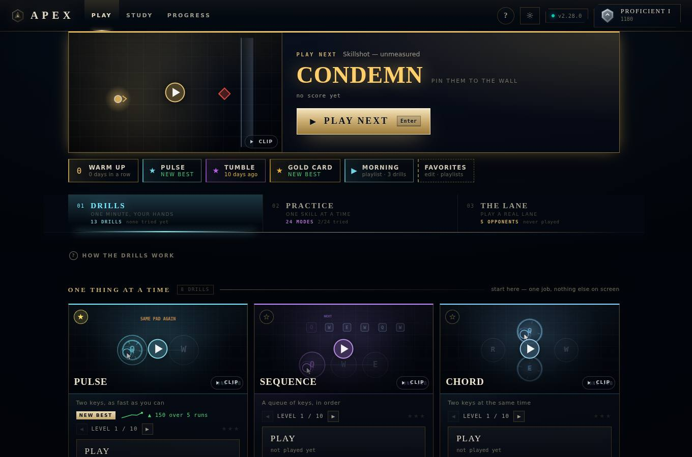 |
| PLAY, 390 |  | 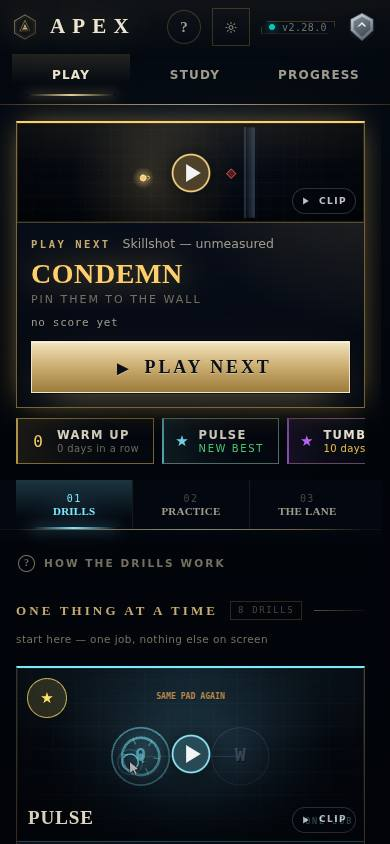 |
| PLAY, new profile, 1360 |  | 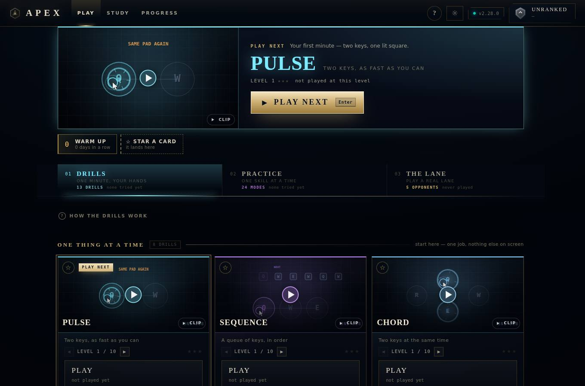 |
| PLAY, new profile, 390 |  | 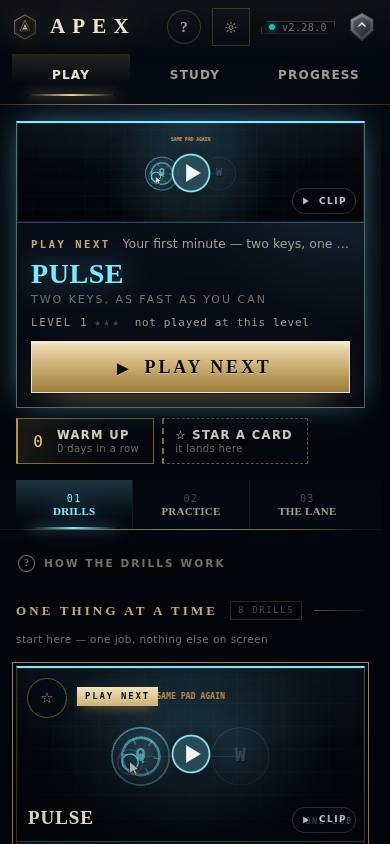 |
| PRACTICE, 1360 | 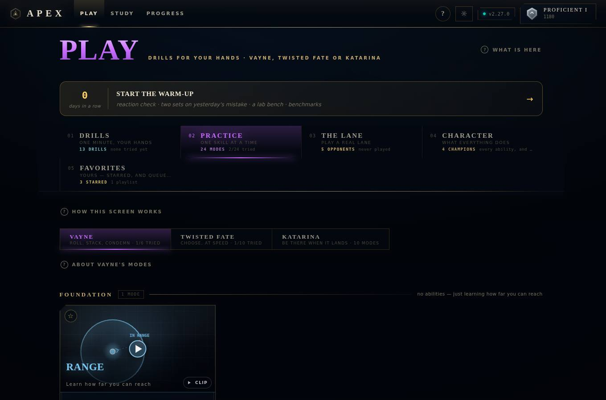 | 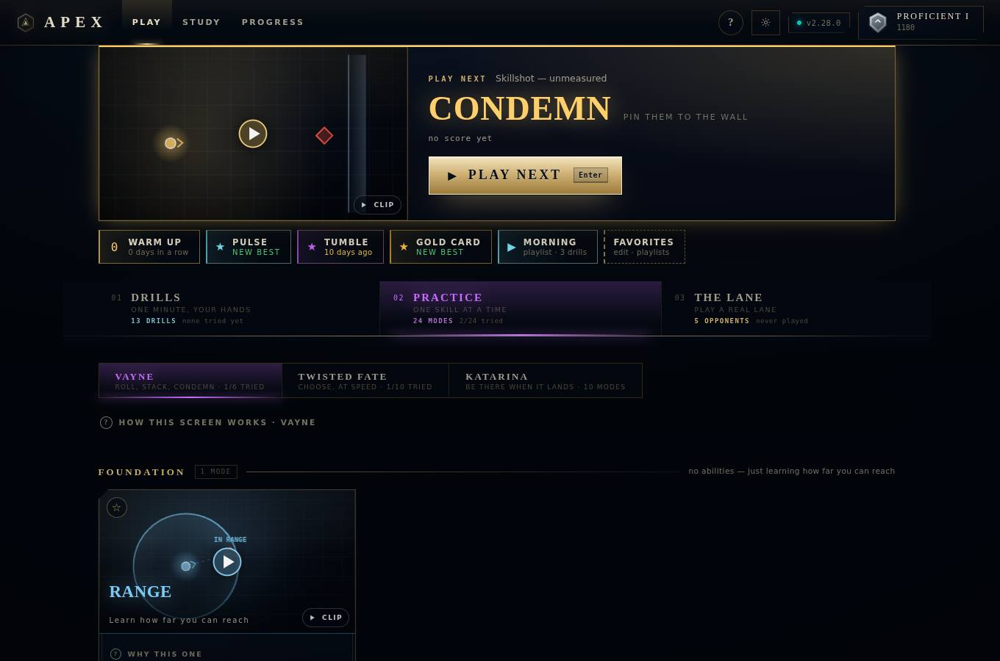 |
| PRACTICE, 390 | 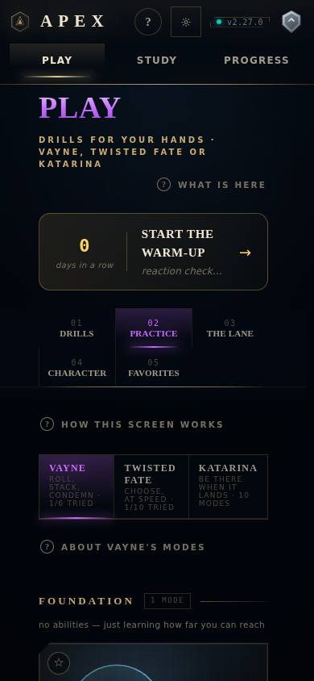 | 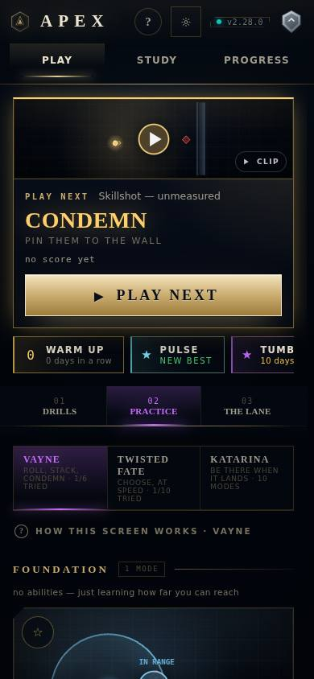 |
| Results, 1360 | 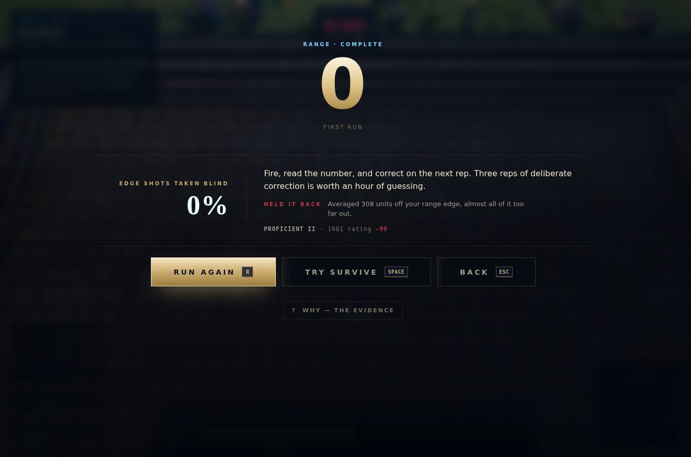 | 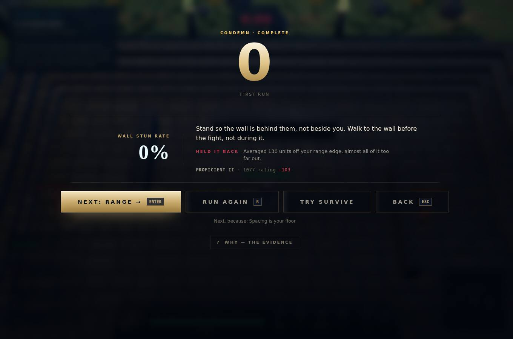 |
| Results, 390 | 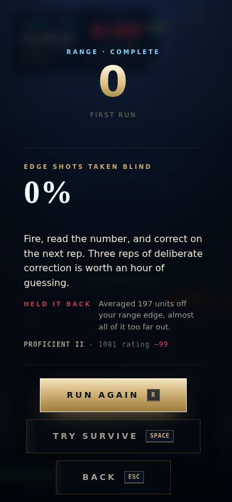 | 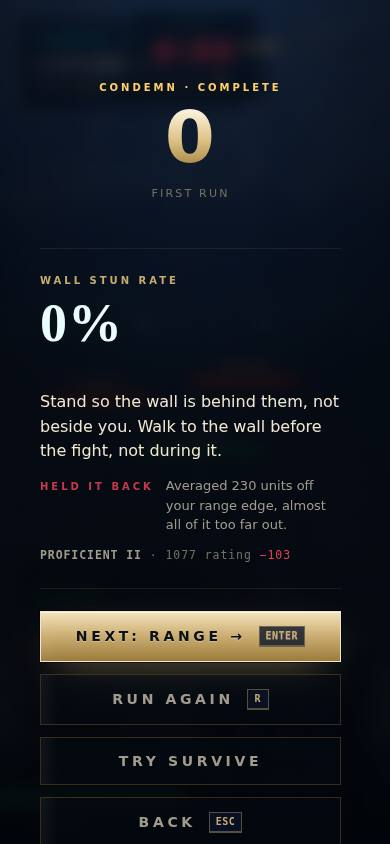 |
| Back from results, 1360 |  | 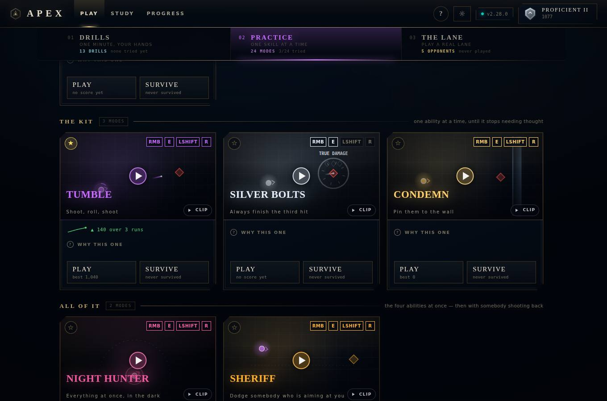 |
| Back from results, 390 | 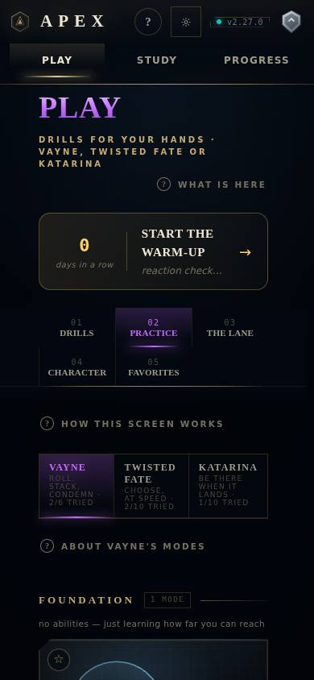 | 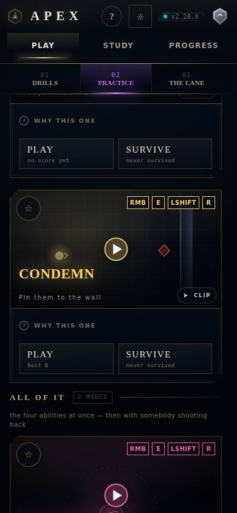 |
| STUDY, 1360 | 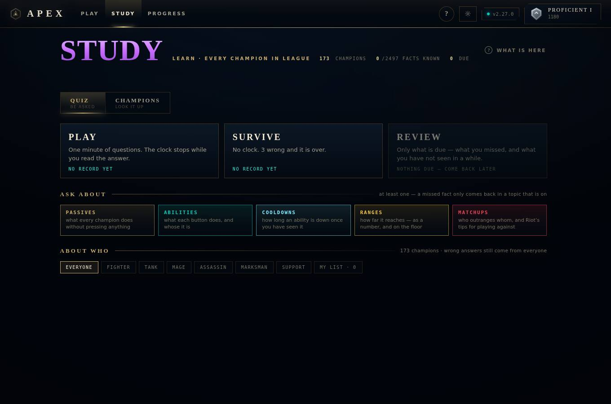 | 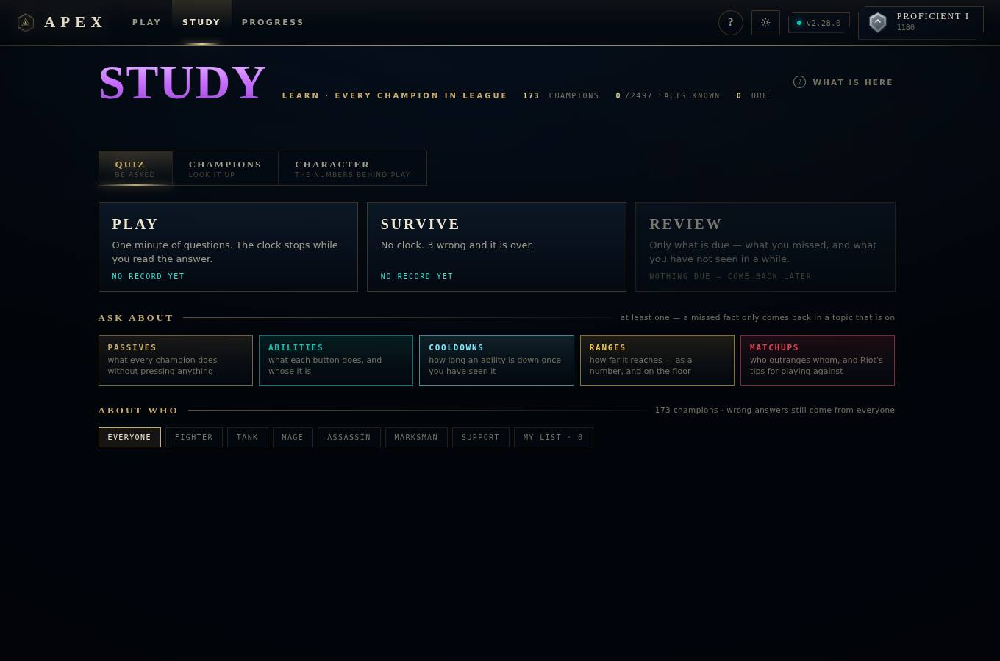 |
| STUDY, 390 | 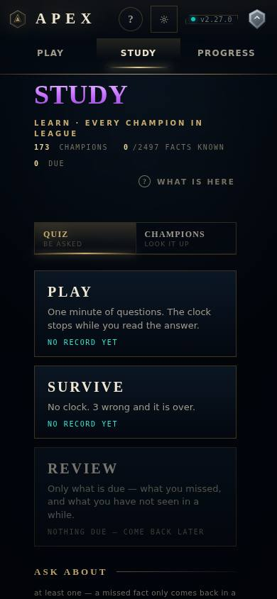 | 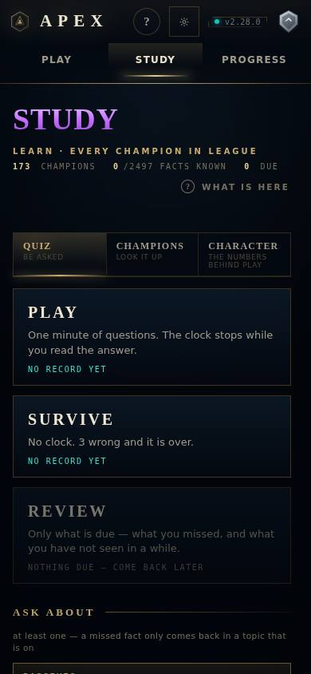 |
| FAVORITES tab (before only; now the shelf) | 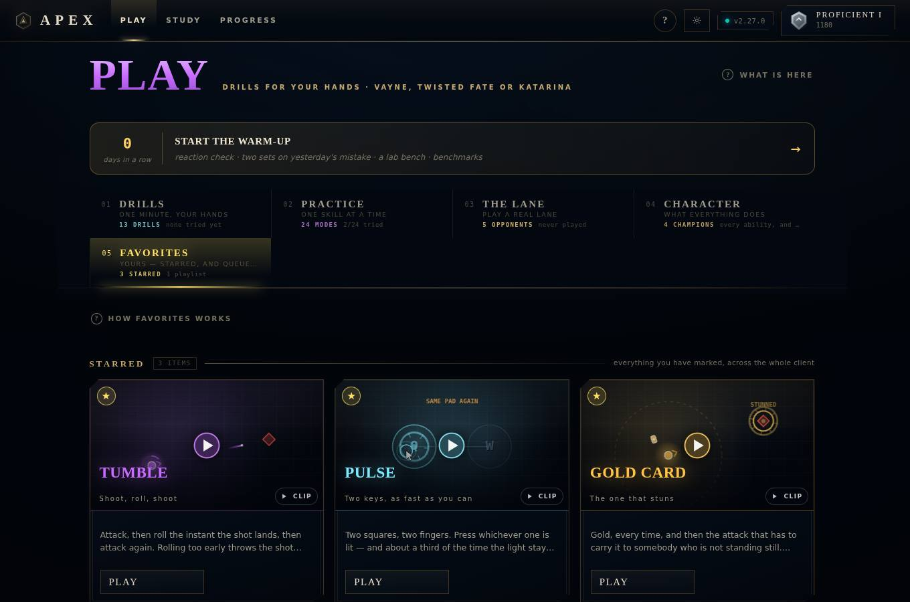 | the shelf under PLAY NEXT, above |

## What did not change

- No score, rating, difficulty, ladder or simulation code was touched. The
  release reads the coach (`recommend()`), the plan (`buildPlan()`) and the
  history, and writes nothing new. `npm test` (simtest and the profile check)
  passes after every step.
- No new profile field. Stars and playlists are read exactly as before.
- No content was deleted. Every sentence that left the first screen is
  behind a WHY: the header's subtitle and "what is here", each card's brief
  and transfer note, a bench's "you do", "hard bit", its level's key count and
  the ten-rung strip, DRILLS' legend and PRACTICE's explainer. CHARACTER moved
  whole to STUDY. FAVORITES is still a full section, reached from the shelf.
- `tools/profilecheck.ts` still walks every PLAY section through
  `SECTION_IDS` (DRILLS, PRACTICE, THE LANE, FAVORITES) and now also draws
  STUDY's CHARACTER on every profile.

## Deliberately not done

- **SURVIVE, SURGE and ENDLESS are not behind "why this one".** They are ways
  to play a card, not explanations of it. SURVIVE stays beside PLAY on a
  mode. SURGE and ENDLESS sit side by side as one row under a bench's PLAY,
  instead of two stacked rows.
- **The rail's sub-lines and counts stay.** They are most of the words left
  above the first section card, and they are also the only per-section
  progress ("2/24 tried") on PLAY.
- **PROGRESS is unchanged.** Per-drill improvement now lives on the cards.
  The screen is still there for the whole-profile view.
- **The coach's pick for a new player after their first run** is whatever
  `recommend()` says, usually an unmeasured skill on a champion mode. The
  pick was not tuned, because tuning it would mean changing the coach.
